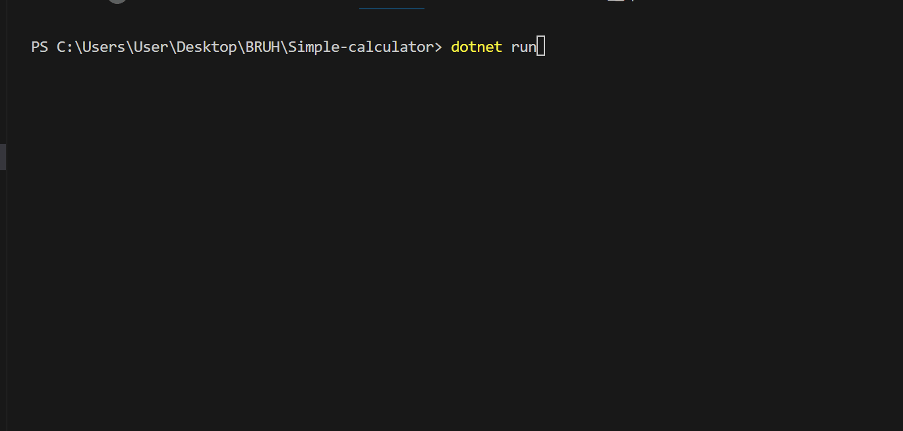

# Simple-calculator
Bu __code__ lar ___oddiy canculator___ yaratishda yordam beradi.
Asosiy code uchun:
```csharp


int number ,number_2;
System.Console.Write("Enter first number: ");
number = int.Parse(Console.ReadLine());
System.Console.Write("Enter second number: ");
number_2 = int.Parse(Console.ReadLine());
string amal;
System.Console.Write("amalni kiriting: ");
amal = Console.ReadLine();
number = ((int)number);

//business logic
if (amal == "+")
{
    System.Console.WriteLine(number + number_2);
}
else if (amal == "-")
{
    System.Console.WriteLine(number - number_2);
}
else if (amal == "*")
{
    System.Console.WriteLine(number * number_2);
}
else if (amal == "/")
{
    System.Console.WriteLine(number / number_2);
}
```
Bu asosiy **code** larni yozganingizdan so'ng **dotnet run** qilib avval **1-sonni** keyin **2-sonni** keyin qanday amal orqali ishlamoqchi ekanligingizni __(-,/,+ yoki *)__ ishoralirini qo'ying.
## Natija:

Agar sizda ham shunday javoblar chiqsa to'g'ri qilgan bo'lasiz!